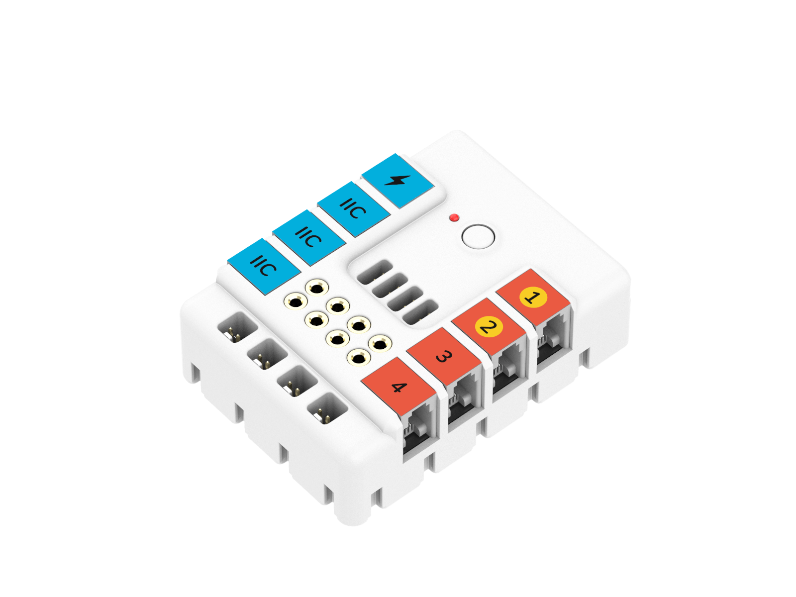

# NeZha V2 Expansion Pack



The NeZha V2 Expansion Pack is tailored for the micro:bit, aimed at stimulating students' innovative thinking and practical skills. This guide facilitates programming and control of the NeZha V2 Expansion Board, enabling functions such as motor control and sensor integration. To purchase the NeZha V2, visit the [Elecfreaks Official Store](https://shop.elecfreaks.com/products/nezha-breakout-board-v2).

## Key Features

- **Independent Motor Control:** Directly manipulate motor direction using onboard buttons, even without connecting to the micro:bit.
- **LEGO & Fischertechnik Compatibility:** Interfaces on the casing align with LEGO and Fischertechnik bricks, fostering personalized electronic project constructions.
- **Color Recognition System:** An intuitive labelling system using colors simplifies sensor and port connections.

## Getting Started

### Installing the Extension

1. Launch MakeCode editor and click the "Extensions" icon.
2. Search for "NeZha V2" or paste the link "https://github.com/elecfreaks/pxt-nezha2" to download and install the extension.

### Basic Examples

#### Motor Rotation Control

**Block Editor Example**

1. Drag the "on button A pressed" block into the script area.
2. Below it, insert the "NeZha V2 - Start Motor" block, set to Motor M1 rotating clockwise.
3. Repeat for Button B, controlling other motors as desired.

**JavaScript Example**

```javascript
input.onButtonPressed(Button.A, function () {
    NEZHA_V2.nezha2MotorStart(MotorPosition.M1, MovementDirection.CW);
});
// Example code omitted; add logic here for Button B controlling different motors
```

#### Moving Motor to a Specified Position

**Block Editor Example**

1. Utilize the "on button B pressed" block.
2. Append the "NeZha V2 - Go To Absolute Position" block, specifying Motor M1 to rotate clockwise to position 0.

**JavaScript Example**

```javascript
input.onButtonPressed(Button.B, function () {
    NEZHA_V2.goToAbsolutePosition(MotorPosition.M1, ServoMotionMode.CW, 0);
});
```

## Advanced Applications

Delve into advanced functionalities like motor speed regulation and sensor data retrieval. For detailed examples and instructions, visit our [online tutorials](https://wiki.elecfreaks.com/en/microbit/expansion-board/nezha-v2/).

## Supported Targets

- PXT/micro:bit

## License

This extension is licensed under the MIT License.